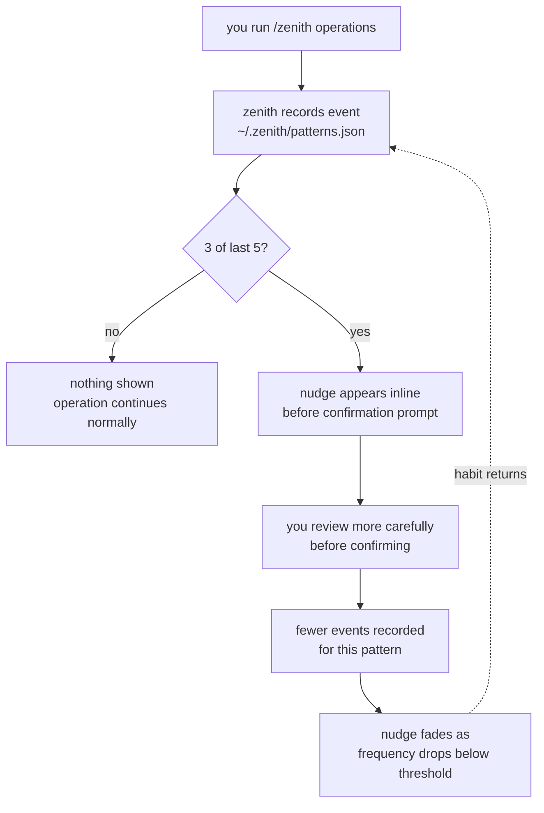

# Pattern learning

Zenith silently tracks your workflow events and surfaces behavioral nudges when a pattern recurs — before the operation that would repeat the mistake.

## The feedback loop

Raw Claude Code has no memory between sessions. Ask it to help you commit every day for a month and it will never notice you always forget to stage a file. Every session starts fresh.

Zenith's pattern store changes this. Each operation you run is an observation. After enough observations, Zenith knows which mistakes you tend to repeat — and tells you about them before you make them again. The nudges appear inline in the confirmation prompt, not as interruptions. As your habits improve, the nudges fade. If a habit returns, so does the nudge.



| | Raw Claude Code | Zenith |
|---|---|---|
| Remembers your mistakes | Never — stateless per session | Yes — persists across sessions and repos |
| Knows your habits | No | Yes — per-repo pattern store |
| Gets better over time | No | Yes — nudges fade as behavior improves |
| Requires configuration | — | None — observes automatically |

---

## How it works

After each operation, Zenith records an event to `~/.zenith/patterns.json`. When a pattern appears in 3 of your last 5 relevant operations in a repo, a nudge appears inline in the confirmation prompt for that operation. No separate command, no dashboard — it shows up exactly when it's useful.

**Tracked patterns:**

| Pattern | Recorded when | Nudge appears |
|---------|--------------|---------------|
| `amend_after_commit` | You run `forgot a file` or `fix commit message` | Before the next `save my work` confirmation — "you've amended after committing N of your last 5 saves" |
| `push_behind_main` | You push while ≥5 commits behind main | Before the next push confirmation when behind ≥5 — "you've pushed with a large gap before, consider syncing first" |
| `contamination` | A scope warning fires during save or push | Same scope warning gets a historical count added — "this has happened N of your last 5 commits" |

**Example — amend nudge:**
```
committing — saving a permanent snapshot on your branch
│ src/train.py   +24 -3
│ can be undone safely with /zenith undo last commit
│ heads up  you've amended after committing 3 of your last 5 saves — review staged changes carefully

Commit these? [y/n]
```

**Storage:** `~/.zenith/patterns.json` — global across repos, local to your machine, never committed. Data is keyed by repo so patterns don't bleed across projects.
